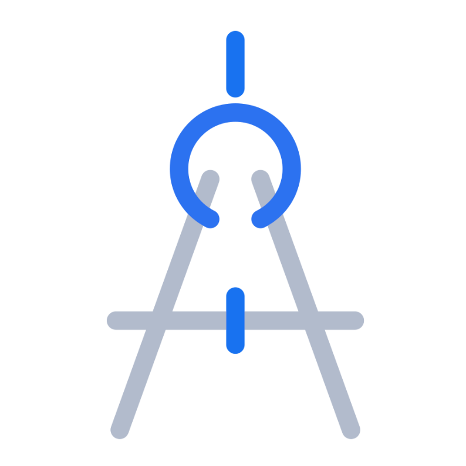

<!-- PROJECT LOGO -->
<br/>
<div align="center">
  <a href="https://gitlab.com/cadbase/cdbs-app">
    
  </a>
  <h3>CADBase Welcome</h3>
  <p>
    <a href="https://cadbase.rs">View site</a>
    ·
    <a href="https://gitlab.com/cadbase/welcome/issues">Report Bug</a>
    ·
    <a href="https://gitlab.com/cadbase/cdbs-app/issues">Request Feature</a>
  </p>
</div>

# CADBase Website Generator

Static multilingual website generator for [CADBase](https://cadbase.rs) - a cloud platform for engineers and 3D creators to manage, collaborate, and share CAD projects.

## About CADBase Platform

CADBase is a platform that connects CAD tools like FreeCAD and Blender with cloud storage, version control, and collaboration features. This repository contains the source code for the official CADBase informational website, documentation, and blog articles.

## 🌐 Overview

This generator creates a static multilingual website for CADBase using Jinja2 templates. It supports three languages (English, Russian, Chinese) and generates SEO-optimized pages with proper meta tags, Open Graph, and structured data.

## 🚀 Quick Start

### Prerequisites
- Python 3.7+
- Jinja2 library

### Installation

```bash
# Clone repository
git clone <repository-url>
cd cadbase-website

# Create virtual environment (recommended)
python -m venv venv

# Activate virtual environment
# On Windows:
venv\Scripts\activate
# On macOS/Linux:
source venv/bin/activate

# Install dependencies
pip install jinja2
```

### Generate Website
```bash
python generate-static.py
```

## 📁 Project Structure

```
├── generate-static.py                # Main generator script
├── i18n/
│   ├── locales/
│   │   ├── en.json            # English translations & articles
│   │   └── [lang].json        # Translations & articles
│   └── templates/             # Base template (header, footer, etc.)
├── pages/
│   ├── index/
│   │   └── template.html      # Homepage template
│   ├── overviews/
│   │   ├── template.html      # Overviews listing template
│   │   └── article/
│   │       └── template.html  # Individual article template
│   ├── privacy-notice/
│   │   └── template.html      # Privacy policy template
│   └── terms/
│       └── template.html      # Terms of service template
└── dist/                      # Generated static site
    ├── index.html             # Language detection and redirect
    ├── [assets]/              # CSS, JS, images
    └── [lang]/                # en/, ru/, zh/
        └── [page]/            # overviews/, terms/, etc.
            └── index.html     # SPA-friendly structure
```

## 🛠️ Usage

### Basic Generation
```bash
# Generate all pages for all languages
python generate-static.py
```

### Output Structure
The generator creates static HTML files in the `dist/` directory:
- `dist/en/` - English version
- `dist/ru/` - Russian version
- `dist/zh/` - Chinese version

## 📝 Adding New Articles

### Step 1: Edit Language JSON Files
Add your article to all three language files:

**`i18n/locales/en.json`**
```json
{
  "overviews": {
    "articles": [
      {
        "page_name": "article-slug",
        "title": "Article Title",
        "excerpt": "Brief description of the article",
        "meta": {
          "title": "SEO Title",
          "description": "SEO description",
          "og_image": "images/og/article-image.webp",
          "og_type": "article",
          "author": "Author Name",
          "keywords": "keyword1, keyword2"
        },
        "url": "overviews/article-slug/",
        "published": {
          "date_iso": "2024-01-15",
          "date": "January 15, 2024"
        },
        "image": {
          "path": "images/articles/article-preview.webp",
          "alt": "Article preview image"
        },
        "content": "Full article content in HTML format",
        "conclusion": "Article conclusion summary",
        "next": "next-article-slug",
        "reference_materials": [
          "Reference 1 - Description",
          "Reference 2 - Description"
        ],
        "external": false,
        "tags": ["Tag1", "Tag2", "Tag3"]
      }
    ]
  }
}
```

**Repeat for `ru.json` and `zh.json`** with translated content.

### Step 2: Add Article Content
Create the article content in HTML format within the `content` field:

```json
"content": "<h2>Introduction</h2><p>Article content here...</p><h3>Features</h3><ul><li>Feature one</li><li>Feature two</li></ul>"
```

### Step 3: Generate
Run the generator to create the new article pages:
```bash
python generate-static.py
```

## 🌍 Adding New Languages

### Step 1: Create Language File
Create a new JSON file in `i18n/locales/` (e.g., `fr.json` for French):

```json
{
  "meta": {
    "site_name": "CADBase",
    "base_url": "https://cadbase.rs/fr/",
    "root_url": "https://cadbase.rs/",
    "title_suffix": " - CADBase",
    "description": "French description of CADBase platform",
    "keywords": "french,keywords,here",
    "og_image": "images/og-image.webp",
    "og_type": "website",
    "twitter_site": "@cadbase_rs",
    "twitter_creator": "@cadbase_rs"
  },
  "overviews": {
    "articles": [
      // Add French versions of articles here
    ]
  }
  // Add other translations...
}
```

### Step 2: Update Generator
Modify `generate-static.py` to include the new language:

```python
languages = ['en', 'ru', 'zh', 'fr']  # Add new language code
```

### Step 3: Generate
```bash
python generate-static.py
```

## 🔧 Generator Configuration

### Supported Pages
The generator currently supports:
- Homepage (`index`)
- Articles overview (`overviews`)
- Privacy policy (`privacy-notice`)
- Terms of service (`terms`)

### Adding New Page Types
1. Create template in `pages/new-page-type/template.html`
2. Add page configuration in `generate-static.py`:

```python
tml = [
    ('new-page-type', 'path/'),
    # ... existing pages
]
```

## 🎨 Templates System

### Base Template Variables
- `{{ lang_code }}` - Language code (en/ru/zh)
- `{{ page_name }}` - Current page identifier
- `{{ assets_prefix }}` - Relative path to assets
- `{{ meta.* }}` - SEO and meta information
- `{{ art.* }}` - Article data (in article templates)

### Custom URL Filter
The `smart_url` filter handles different URL types:
- External links → `target="_blank"`
- Internal links → Proper relative paths
- Anchor links → Preserved as-is

## 📊 SEO Features

Generated pages include:
- **Multi-language meta tags** with hreflang alternates
- **Open Graph** tags for social sharing
- **Twitter Card** meta tags
- **JSON-LD structured data** (Organization + Website)
- **Canonical URLs**
- **Language-specific descriptions**

## 🚀 Deployment

### Static Hosting
The `dist/` directory contains pure HTML/CSS/JS files suitable for:
- GitHub Pages
- Netlify
- Vercel
- Apache/Nginx
- AWS S3 + CloudFront

## 🔄 Workflow

1. **Content Creation**: Edit JSON files in `i18n/locales/`
2. **Template Development**: Modify templates in `pages/`
3. **Generation**: Run `python generate-static.py`
4. **Testing**: Review generated files in `dist/`
5. **Deployment**: Upload `dist/` contents to web server

## 🐛 Troubleshooting

### Common Issues

**Template not found**
- Check template paths in `pages` configuration
- Verify file exists in correct directory

**Missing translations**
- Ensure all language JSON files have the same structure
- Check for typos in variable names

**Broken links**
- Verify `assets_prefix` configuration for each page type
- Check URL handling in templates

### Debug Mode
Add debug output to inspect variables:

```python
# In generate-static.py
print(f"Variables: {page_variables.keys()}")
```

## 📄 License

This project is part of CADBase platform. See project documentation for licensing information.

## 🤝 Contributing

1. Fork the repository
2. Create a feature branch
3. Add/update content in JSON files
4. Test generation locally
5. Submit pull request

## 📞 Support

For issues with the website generator:
- Create an issue in the repository
- Check existing JSON structure examples
- Verify Python and Jinja2 versions

---

**Note**: Always test generation locally before deploying to production. Verify all language versions are properly synchronized.